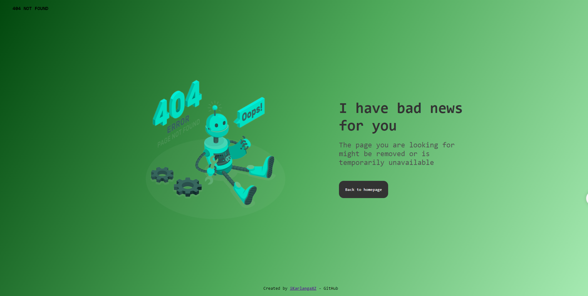

# Página de Error 404

Este proyecto consiste en una página de error 404 personalizada que proporciona información útil cuando un usuario intenta acceder a una página que no existe o no está disponible temporalmente.

## Captura de Pantalla

## Descripción

La página de error 404 incluye un mensaje claro indicando que la página solicitada no se puede encontrar. También proporciona una breve explicación de posibles razones por las cuales la página no está disponible, y un botón para regresar a la página de inicio.

## Tecnologías Utilizadas

- HTML5
- CSS3

## Guía de Uso

1. Clona este repositorio en tu máquina local.
2. Abre el archivo `index.html` en tu navegador web.

## Autor

- [KarlangaXZ](https://github.com/KarlangaXZ)

## Licencia

Este proyecto está bajo la Licencia [MIT](LICENSE).
